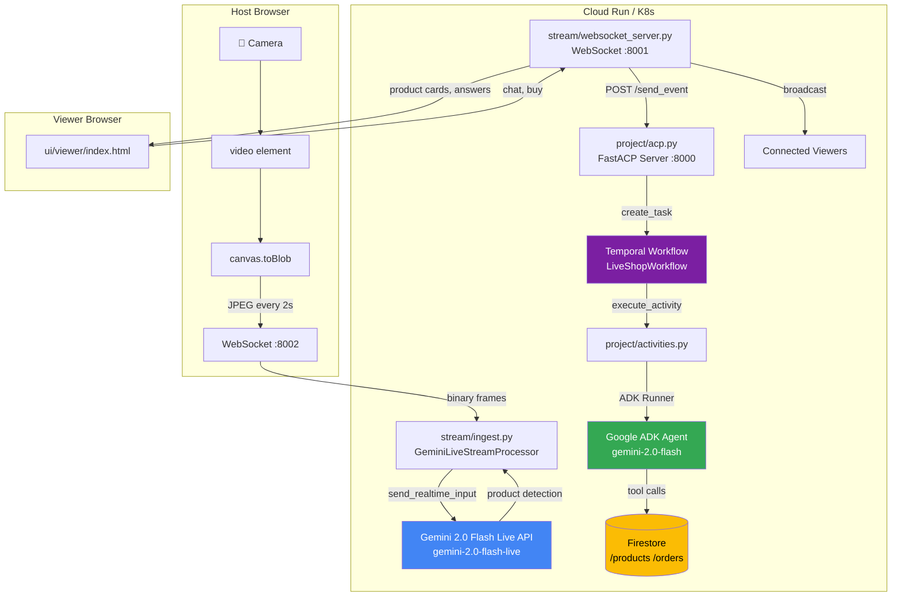
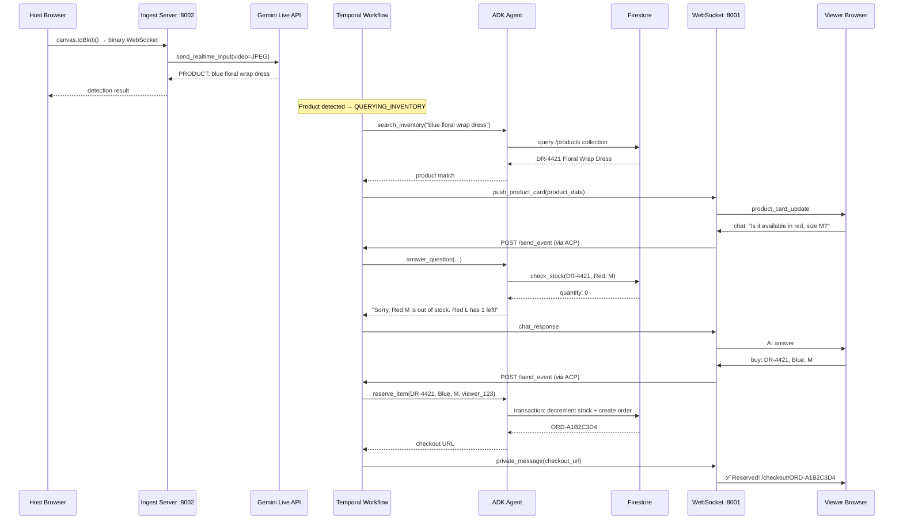
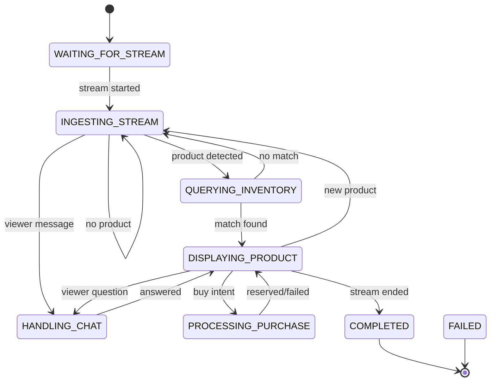

# 🛍️ LiveShop — AI-Powered Live Commerce Agent

**An AI agent that watches a host's live camera stream, auto-detects products using Gemini Live API, answers viewer questions in real-time, and enables one-click purchases — all powered by Google ADK and Firestore.**

## Architecture



## Data Flow



## State Machine



## Tech Stack

| Component | Technology | Purpose |
|-----------|-----------|---------|
| **Video Analysis** | Gemini 2.0 Flash Live (`gemini-2.0-flash-live`) | Real-time video frame analysis via `google.genai` Live API |
| **Agent Orchestration** | Google ADK (`google-adk`) | Tool registration, autonomous tool calling, session management |
| **Text Q&A + Tools** | Gemini 2.0 Flash (`gemini-2.0-flash`) | Answer viewer questions, call inventory/stock tools |
| **Workflow Engine** | Temporal | Durable state machine with 8 states, signal handling |
| **Agent Protocol** | AgentEx FastACP | Async ACP server for task creation and event routing |
| **Database** | Google Cloud Firestore | Product catalog (`/products`), orders (`/orders`), sessions |
| **Frame Transport** | WebSocket + `canvas.toBlob()` | Host browser captures JPEG frames → server every 2s |
| **Viewer Push** | WebSocket | Real-time product cards, chat responses, checkout URLs |
| **Chat → Workflow** | HTTP (`httpx`) | WebSocket server calls ACP `/send_event` endpoint |

## Project Structure

```
agents/live-shop/
├── project/
│   ├── acp.py                          # FastACP server (port 8000)
│   ├── agent.py                        # ADK Agent with 3 Firestore-backed tools
│   ├── activities.py                   # 6 Temporal activities (all real, no mocks)
│   ├── workflow.py                     # Main Temporal workflow
│   ├── run_worker.py                   # Temporal worker entry point
│   ├── prompts/
│   │   └── system_prompt.py            # System prompts for Gemini
│   ├── state_machines/
│   │   └── live_shop.py                # 8-state state machine + data models
│   └── workflows/live_shop/
│       ├── waiting_for_stream.py       # Wait for host to go live
│       ├── ingesting_stream.py         # Process video frames
│       ├── querying_inventory.py       # Match detection → Firestore product
│       ├── displaying_product.py       # Push product card, wait for interaction
│       ├── handling_chat.py            # Answer viewer questions via ADK
│       ├── processing_purchase.py      # Reserve item via Firestore transaction
│       └── terminal_states.py          # COMPLETED / FAILED
├── stream/
│   ├── ingest.py                       # Gemini Live API frame processor (port 8002)
│   └── websocket_server.py             # Viewer WebSocket + ACP bridge (port 8001)
├── db/
│   ├── firestore_client.py             # Async Firestore client
│   └── seed_inventory.py               # Seed 6 products into Firestore
├── ui/
│   ├── host/
│   │   ├── index.html                  # Host dashboard
│   │   └── dashboard.js                # canvas.toBlob() → WebSocket frame capture
│   └── viewer/
│       ├── index.html                  # Viewer stream page
│       ├── stream.js                   # WebSocket connection + chat
│       └── product_card.js             # Floating product card UI
├── chart/live-shop/                    # Helm chart for K8s deployment
│   ├── Chart.yaml
│   ├── values.yaml
│   └── charts/temporal-worker/         # Temporal worker subchart
├── Dockerfile
├── pyproject.toml
├── manifest.yaml
└── environments.yaml
```

## ADK Tools (Real Firestore)

All three ADK tools query **real Firestore** — no mocks, no hardcoded data:

### `search_inventory(visual_description: str) → dict`
Searches the `/products` Firestore collection using tag-based matching. Scores products by tag overlap, name word overlap, and description word overlap. Returns the best match with full product details.

### `check_stock(sku: str, color?: str, size?: str) → dict`
Reads the `/products/{sku}` Firestore document and returns real-time stock for the requested variant. Supports filtering by color, size, or both.

### `reserve_item(sku: str, color: str, size: str, viewer_id: str) → dict`
Uses a **Firestore transaction** to atomically:
1. Read current stock for the variant
2. Verify quantity > 0
3. Decrement stock by 1
4. Create an order document in `/orders/{order_id}`
5. Return checkout URL with 10-minute expiration

## Two Gemini Models

| Model | Used In | Purpose |
|-------|---------|---------|
| `gemini-2.0-flash-live` | `stream/ingest.py` | Real-time video streaming via Live API (`client.aio.live.connect()`) |
| `gemini-2.0-flash` | `project/agent.py` | Text Q&A + autonomous tool calling via ADK |

The Live model only supports streaming video/audio input. The standard model supports tool calling. They are configured via separate env vars: `GEMINI_LIVE_MODEL` and `GEMINI_MODEL`.

## WebSocket → Temporal Bridge

Viewer chat messages flow through a real bridge:

```
Viewer Browser
    ↓ WebSocket (ws://host:8001/viewer/{session}/{viewer})
websocket_server.py._handle_viewer()
    ↓ msg_type == "chat" or "buy"
websocket_server.py._forward_to_acp()
    ↓ HTTP POST
ACP Server /tasks/{task_id}/send_event
    ↓ Temporal signal
workflow.on_task_event_send()
    ↓ state machine transition
HANDLING_CHAT or PROCESSING_PURCHASE
```

## Setup

### 1. Seed Firestore

```bash
# Set your GCP project and credentials
export PROJECT_ID=your-gcp-project
export FIRESTORE_CREDS='{"type":"service_account",...}'

# Seed 6 demo products into Firestore
python db/seed_inventory.py --project $PROJECT_ID

# Or dry-run to see what would be seeded
python db/seed_inventory.py --dry-run
```

### 2. Set Environment Variables

```bash
export GEMINI_API_KEY=your-gemini-api-key
export GEMINI_MODEL=gemini-2.0-flash
export GEMINI_LIVE_MODEL=gemini-2.0-flash-live
export FIRESTORE_CREDS='{"type":"service_account",...}'
export PROJECT_ID=your-gcp-project
```

### 3. Run Locally

```bash
# Start the ACP server
uvicorn project.acp:acp --host 0.0.0.0 --port 8000

# Start the Temporal worker (separate terminal)
python -m project.run_worker

# Start the frame ingestion server (separate terminal)
python -m stream.ingest

# Start the viewer WebSocket server (separate terminal)
python -m stream.websocket_server
```

### 4. Deploy to K8s

```bash
helm install live-shop chart/live-shop/ -f chart/live-shop/values.yaml
```

## Key Design Decisions

1. **No WebRTC** — Uses `canvas.toBlob()` → WebSocket for frame transport. Simpler than WebRTC, works on Cloud Run, no TURN/STUN servers needed.

2. **Two Gemini models** — Live API model for video streaming, standard model for text Q&A + tool calling. They have different capabilities.

3. **Real Firestore transactions** — `reserve_item` uses `@firestore.transactional` to atomically decrement stock and create orders. No race conditions.

4. **WebSocket → ACP bridge** — Viewer chat messages are forwarded to the Temporal workflow via HTTP POST to the ACP `/send_event` endpoint, not just logged.

5. **Google ADK** — Agent orchestration with autonomous tool calling. Gemini decides when to call `check_stock` vs `search_inventory` based on the viewer's question.

6. **No mocks** — All tools query real Firestore. All LLM calls go through real Gemini API. `GEMINI_API_KEY` is required.


## User Flow — End to End

Everything runs through the ACP server at `https://live-shop-acp.rilo.dev`. No separate ports or servers needed.

### URLs

| Page | URL |
|------|-----|
| Host Dashboard | `https://live-shop-acp.rilo.dev/host` |
| Viewer Page | `https://live-shop-acp.rilo.dev/viewer?session={session_id}` |
| Agentex Hub UI | `https://hub.rilo.dev` |

---

### Step 1: Create a Task (Start a Live Session)

A task must be created first via the Agentex Hub or API. This initializes the Temporal workflow.

**Option A — Via Agentex Hub UI:**
1. Open `https://hub.rilo.dev`
2. Select the **live-shop** agent
3. Send a message: `start`
4. Note the **task ID** from the URL or response

**Option B — Via API:**
```bash
curl -X POST https://hub-api.rilo.dev/agents/live-shop/tasks \
  -H "Content-Type: application/json" \
  -d '{
    "input": {
      "session_id": "stream-001",
      "host_name": "Sara"
    }
  }'
```

The response returns a `task_id`. This becomes the `session_id` for the stream.

---

### Step 2: Host Goes Live

1. Open the **Host Dashboard**: `https://live-shop-acp.rilo.dev/host`
2. Click **"Go Live"** — the browser requests camera access
3. Once granted, the browser:
   - Shows a local camera preview
   - Captures JPEG frames every 2 seconds via `canvas.toBlob()`
   - Sends frames over WebSocket to `wss://live-shop-acp.rilo.dev/ws/ingest/{session_id}`
4. The ACP server feeds each frame to **Gemini 2.0 Flash Live API**
5. Gemini analyzes the frame and responds with product descriptions
6. The Host Dashboard shows detection results in the **AI Detection Log** panel

```
Host Browser                          ACP Server (:8000)              Gemini Live API
─────────────                         ──────────────────              ───────────────
getUserMedia() → camera
canvas.toBlob() every 2s
  └── JPEG binary ──── WSS /ws/ingest/{session_id} ────►
                                      GeminiLiveStreamProcessor
                                        send_realtime_input(video=JPEG)──►
                                                                      "PRODUCT: Red silk dress"
                                      ◄── detection result ───────────
  ◄── {type:"detection", ...} ────────
Dashboard shows: "Product detected: Red silk dress"
```

The host can also **manually pin a product** using the dropdown selector on the dashboard, bypassing auto-detection.

---

### Step 3: Viewers Join the Stream

1. Share the viewer link: `https://live-shop-acp.rilo.dev/viewer?session={session_id}`
2. Viewers open the link in their browser
3. The viewer page connects via WebSocket to `wss://live-shop-acp.rilo.dev/ws/viewer/{session_id}/{viewer_id}`
4. Viewers receive:
   - **Product card updates** — floating card with name, price, colors, sizes, stock
   - **Stock updates** — real-time badge changes (In Stock → Low Stock → Out of Stock)
   - **Chat responses** — AI answers to their questions

---

### Step 4: AI Product Detection → Inventory Lookup → Product Card Push

When Gemini detects a product, the Temporal workflow transitions through these states:

```
WAITING_FOR_STREAM
       │ (host sends "start" or clicks Go Live)
       ▼
INGESTING_STREAM
       │ (Gemini detects: "PRODUCT: Red silk dress")
       ▼
QUERYING_INVENTORY
       │ search_inventory(visual_description) → Firestore
       │ check_stock(sku) → Firestore
       │ Returns: {sku, name, price, variants, stock}
       ▼
DISPLAYING_PRODUCT
       │ push_product_card() → WebSocket broadcast to all viewers
       │ Viewers see: floating product card with buy button
       ▼
INGESTING_STREAM  (loops back, waiting for next product)
```

---

### Step 5: Viewer Asks a Question (Chat)

1. Viewer types a question in the chat input, e.g. "Does this come in blue?"
2. Message flows:

```
Viewer Browser                        ACP Server                      Temporal Workflow
──────────────                        ──────────                      ─────────────────
{type:"chat", content:"..."}
  └── WSS /ws/viewer/{sid}/{vid} ──►
                                      POST /tasks/{task_id}/send_event
                                        └── Temporal signal ──────────►
                                                                      on_task_event_send()
                                                                      state → HANDLING_CHAT
                                                                      Gemini ADK agent:
                                                                        - check_inventory tool
                                                                        - answer with product info
                                                                      ◄── response ────────────
                                      ◄── broadcast to viewers ───────
  ◄── {type:"chat_response", ...} ──
Viewer sees: "Yes! Available in Royal Blue, Navy, and Sky Blue."
```

---

### Step 6: Viewer Clicks "Buy"

1. Viewer selects color + size on the product card and clicks **"ADD TO CART"**
2. Purchase flow:

```
Viewer Browser                        ACP Server                      Temporal Workflow
──────────────                        ──────────                      ─────────────────
{type:"buy", sku:"DR-4421",
 color:"Red", size:"M"}
  └── WSS /ws/viewer/{sid}/{vid} ──►
                                      POST /tasks/{task_id}/send_event
                                        content: "I want to buy DR-4421 in Red, size M"
                                        └── Temporal signal ──────────►
                                                                      on_task_event_send()
                                                                      state → PROCESSING_PURCHASE
                                                                      reserve_item() activity:
                                                                        Firestore atomic transaction:
                                                                        - Decrement stock for DR-4421/Red/M
                                                                        - Create reservation doc in /orders
                                                                        - Set 15-min expiry TTL
                                                                      ◄── reservation result ──
                                      ◄── private message ────────────
  ◄── {type:"private_message",
       checkout_url:"..."} ──────────
Viewer sees: "Item reserved! Complete your purchase: <checkout_url>"
Button shows: "RESERVING..." → "ADD TO CART" (re-enabled after 5s)
```

Stock is decremented atomically in Firestore. Other viewers see a real-time stock update:
```
"12 in stock" → "11 in stock" → "Only 3 left!" → "Out of stock"
```

---

### Step 7: Host Ends Stream

1. Host clicks **"End Stream"** on the dashboard
2. Browser sends `{type: "stop"}` over the ingest WebSocket
3. Gemini Live session closes
4. Workflow transitions to `COMPLETED`
5. All viewers receive `{type: "stream_ended"}`
6. Viewer pages show: "The live stream has ended. Thanks for watching!"

---

### Full Architecture Diagram

```
┌───────────────────────────────────────────────────────────────────────────┐
│  Host Browser                                                             │
│  ┌─────────────────────────────────┐                                      │
│  │  /host — Host Dashboard          │                                      │
│  │  ├── Camera preview (getUserMedia)│                                      │
│  │  ├── Go Live / End Stream buttons │                                      │
│  │  ├── AI Detection Log             │                                      │
│  │  ├── Live Stats (viewers, orders) │                                      │
│  │  └── Manual product selector      │                                      │
│  └───────────────┬───────────────────┘                                      │
│                  │ WSS /ws/ingest/{session_id}                              │
│                  │ JPEG frames every 2s                                     │
│                  ▼                                                          │
│  ┌──────────────────────────────────────────────────────────────────┐      │
│  │  ACP Server (FastAPI :8000) — live-shop-acp.rilo.dev             │      │
│  │  ├── /host              → Host Dashboard HTML                     │      │
│  │  ├── /viewer            → Viewer Page HTML                        │      │
│  │  ├── /ws/ingest/{sid}   → Gemini Live API (product detection)     │      │
│  │  ├── /ws/viewer/{sid}/{vid} → Viewer WebSocket (cards, chat, buy) │      │
│  │  ├── /ws/push           → Internal push (agent → viewers)         │      │
│  │  ├── /tasks             → Agentex ACP (create/signal workflows)   │      │
│  │  └── /healthz           → Health check                            │      │
│  └──────────────────────────────┬───────────────────────────────────┘      │
│                K8s (Rilo)       │ Temporal gRPC                            │
└─────────────────────────────────┼─────────────────────────────────────────┘
                                  │
┌─────────────────────────────────┼─────────────────────────────────────────┐
│             Google Cloud        │                                          │
│                                 ▼                                          │
│  ┌──────────────────────────────────────────┐                             │
│  │  Cloud Run — Temporal Worker              │                             │
│  │  ├── LiveShopWorkflow (8-state machine)   │                             │
│  │  │   ├── WAITING_FOR_STREAM               │                             │
│  │  │   ├── INGESTING_STREAM                 │                             │
│  │  │   ├── QUERYING_INVENTORY               │                             │
│  │  │   ├── DISPLAYING_PRODUCT               │                             │
│  │  │   ├── HANDLING_CHAT                    │                             │
│  │  │   ├── PROCESSING_PURCHASE              │                             │
│  │  │   ├── COMPLETED                        │                             │
│  │  │   └── FAILED                           │                             │
│  │  ├── Activities (Gemini ADK agent)        │                             │
│  │  │   ├── search_inventory()               │                             │
│  │  │   ├── check_stock()                    │                             │
│  │  │   ├── reserve_item()                   │                             │
│  │  │   ├── answer_chat()                    │                             │
│  │  │   └── push_product_card()              │                             │
│  │  └── Registered: hub-api.rilo.dev         │                             │
│  └──────────┬──────────┬──────────┬──────────┘                             │
│             │          │          │                                         │
│             ▼          ▼          ▼                                         │
│  ┌──────────────┐ ┌─────────┐ ┌───────────┐                               │
│  │  Firestore   │ │ Gemini  │ │  Secret   │                               │
│  │  inventory   │ │ 2.0     │ │  Manager  │                               │
│  │  orders      │ │ Flash   │ │  (API key)│                               │
│  │  sessions    │ │ + Live  │ │           │                               │
│  └──────────────┘ └─────────┘ └───────────┘                               │
└───────────────────────────────────────────────────────────────────────────┘

┌───────────────────────────────────────────────────────────────────────────┐
│  Viewer Browsers (multiple)                                               │
│  ┌───────────────────────────────────┐                                    │
│  │  /viewer?session={session_id}      │                                    │
│  │  ├── LIVE badge + viewer count     │                                    │
│  │  ├── Stream area (placeholder)     │                                    │
│  │  ├── Floating product card         │                                    │
│  │  │   ├── Product name + price      │                                    │
│  │  │   ├── Color swatches            │                                    │
│  │  │   ├── Size selector             │                                    │
│  │  │   ├── Stock badge               │                                    │
│  │  │   └── ADD TO CART button        │                                    │
│  │  └── Live chat (ask + buy)         │                                    │
│  └───────────────────────────────────┘                                    │
│  Connected via: WSS /ws/viewer/{session_id}/{viewer_id}                   │
└───────────────────────────────────────────────────────────────────────────┘
```

---

### Quick Test Checklist

```bash
# 1. Verify ACP is healthy
curl https://live-shop-acp.rilo.dev/healthz

# 2. Verify Cloud Run worker is running
gcloud run services logs read live-shop-worker --region=me-central1 --limit=5
# Expected: "Running workers for task queue: live-shop-queue"

# 3. Verify Agentex API is up
curl https://hub-api.rilo.dev
# Expected: {"detail":"Not Found"} (normal for root path)

# 4. Create a task
curl -X POST https://hub-api.rilo.dev/agents/live-shop/tasks \
  -H "Content-Type: application/json" \
  -d '{"input": {"session_id": "test-001", "host_name": "Sara"}}'

# 5. Open Host Dashboard
# https://live-shop-acp.rilo.dev/host
# Click "Go Live" → grant camera → frames should start sending

# 6. Open Viewer Page (in another tab/device)
# https://live-shop-acp.rilo.dev/viewer?session=test-001
# Should see "Connected to LiveShop!" in chat

# 7. Hold up a product to the camera
# Host dashboard should show detection in AI log
# Viewer should receive a floating product card

# 8. Viewer types "What colors does this come in?" in chat
# AI responds with inventory data from Firestore

# 9. Viewer clicks "ADD TO CART"
# Firestore stock decrements, viewer gets checkout URL
```


